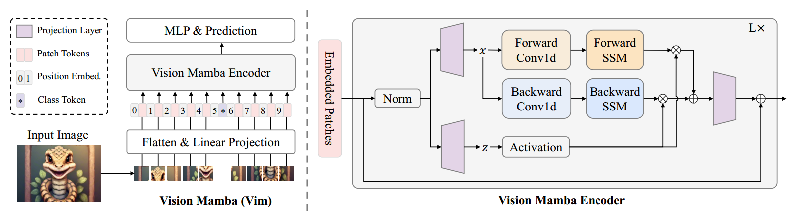

# awsome-Mamba-Transformer-CNN
<h2>
😚😚😚Pytorch-Implementation-single-GPU😚😚😚
<h2>

<h2>
 
  [Vision Mamba](https://github.com/hustvl/Vim)
[](https://huggingface.co/hustvl/Vim-tiny-midclstok) 
[](https://huggingface.co/hustvl/Vim-tiny-midclstok)  
  
  
  [Vmamba](https://github.com/MzeroMiko/VMamba)
[](https://github.com/MzeroMiko/VMamba/releases/download/%23v2cls/vssm_base_0229_ckpt_epoch_237.pth) 
[](https://github.com/MzeroMiko/VMamba/releases/download/%23v2cls/vssm_small_0229_ckpt_epoch_222.pth)  
  
  [Resnet50](https://openaccess.thecvf.com/content_cvpr_2016/html/He_Deep_Residual_Learning_CVPR_2016_paper.html)
[](https://download.pytorch.org/models/resnet50-19c8e357.pth)  


  
  [Swin-Transformer-small](https://openaccess.thecvf.com/content/ICCV2021/html/Liu_Swin_Transformer_Hierarchical_Vision_Transformer_Using_Shifted_Windows_ICCV_2021_paper)
[](https://github.com/SwinTransformer/storage/releases/download/v1.0.0/swin_small_patch4_window7_224.pth)  

  
  [ConvNext](https://github.com/facebookresearch/ConvNeXt)
[](https://dl.fbaipublicfiles.com/convnext/convnext_small_1k_224_ema.pth)  

<h2>

  
<h2>

Causal CNN:  
[](https://github.com/Dao-AILab/causal-conv1d/releases)  


SSM (State Space Model):
  
[](https://github.com/state-spaces/mamba/releases) 

<h2>

# Requirements
```
python==3.10
pytorch==2.1
```
😰`It should be noted that the cuda version must be aligen with python&pytorch. ` [More Details](https://github.com/state-spaces/mamba/issues/97)😰


# Core Framework
## Vision Mamba

## Vmamba


# How to Run
Just 
```
python main.py --opt ./yamls/XXX/ --batch_size 12 --num_epochs 24
```

💥💥If you want to train your own model, jusat change the cfg files from [yamls](./yamls/) as your want


Moreover, i add **5** vision models in [backbones](./models/backbones). the **train&eval engines** can be found in [engines](engines), which include  
[loss_zoo](engines/utils/criterion_factory), [lrschedular_zoo](engines/utils/lrsc_factory), [metrics_zoo](engines/utils/metrics_factory), [optimizer_zoo](engines/utils/optimizers_factory).  

# Train Homemade dataset
😎😎😎
You can write a data reader in the **Pytorch** style, which inherits the **Dataset** class and puts it in [datasets](./datasets). 
Accordingly, you also need to modify the configuration file [yamls](yamls).


# Acknowledgements
💗💗💗  
[Mamba](https://github.com/state-spaces/mamba)  
[VIM](https://github.com/hustvl/Vim)  
[VMamba](https://github.com/MzeroMiko/VMamba)
[Deep Learning](https://github.com/WZMIAOMIAO/deep-learning-for-image-processing/tree/master)  
[BasicSR](https://github.com/XPixelGroup/BasicSR)  
[mmdetection](https://github.com/open-mmlab/mmdetection)

# Mamba Never Out


